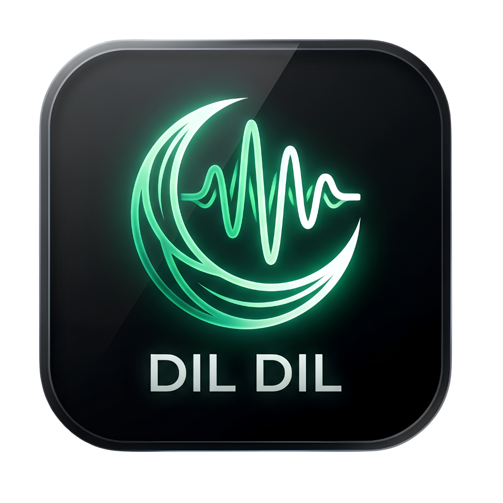

# 🎙️ DIL DIL (دل دل) — Free & Open-Source Wispr Flow for Windows

<div align="center">



### **The Lightning-Fast, Free & Native Wispr Flow / Superwhisper Alternative**
#### *Hold to Speak. Release to Auto-Paste. Works Anywhere.*

[](https://www.python.org/)
[](https://riverbankcomputing.com/software/pyqt/)
[](https://aistudio.google.com/)
[](LICENSE)
[](https://microsoft.com)
[](https://en.wikipedia.org/wiki/Pakistan)

</div>

---

## 🌟 Why DIL DIL?

**DIL DIL** is an ultra-lightweight, zero-bloat desktop voice dictation assistant built specifically for Windows. Inspired by **Wispr Flow** and **Superwhisper**, DIL DIL brings real-time, push-to-talk voice typing to every single application on your computer—**100% free forever** with **zero subscription fees**.

Whether you're writing code in VS Code, drafting emails in Gmail, chatting on WhatsApp, or taking notes in Notion, just hold your hotkey, speak naturally, and let DIL DIL type for you.

> **Proudly crafted in Pakistan 🇵🇰 by [Ahmed Raza](https://github.com/ahmadrazaaq34-create).**

---

## ✨ Key Features

- ⚡ **Universal Push-to-Talk (`Ctrl + Shift`)**: Hold down anywhere in Windows to speak. Release to instantly paste translated text at your cursor.
- 🚀 **Progressive Sentence-by-Sentence Streaming**: No more waiting for the whole recording to finish. Sentence 1 pastes at your cursor while sentence 2 is still streaming!
- 🪶 **Ultra-Lightweight (<30 MB RAM)**: Unlike heavy Electron apps that consume 500 MB+ RAM, DIL DIL uses native Windows Win32 working-set memory trimming to sip just **~27 MB of RAM**.
- 🆓 **100% Free Forever**: Powered by Google Gemini Flash. Comes with **1,500 free requests per day** directly through Google AI Studio. No credit card required.
- 🇵🇰 **Native Urdu, Roman Urdu & English Support**: Speak naturally in colloquial Urdu, Hindi, or Punjabi—DIL DIL transcribes or translates into fluent, grammatically clean English, authentic Urdu script (اردو), or Roman Urdu.
- 🌍 **19+ World Languages**: Supports English, Urdu, Roman Urdu, Arabic, Hindi, Spanish, French, German, Portuguese, Russian, Chinese, Japanese, Turkish, Italian, Persian, Punjabi, Bengali, Dutch, and Indonesian.
- 🎨 **Minimal Floating Pill**: Frameless, translucent neon equalizer pill that floats over your screen and never steals focus from your active document.
- 🛡️ **Zero-Latency IPv4 Routing**: Built-in edge routing eliminates ISP IPv6 timeouts, ensuring blazing-fast ~1.2s response times.
- 📌 **System Tray Background Mode**: Sits quietly in the Windows notification area; launches on startup or on demand.

---

## 📊 Comparison: DIL DIL vs. Paid Alternatives

| Feature | **DIL DIL** 🇵🇰 | **Wispr Flow** | **Superwhisper** |
| :--- | :---: | :---: | :---: |
| **Price** | **100% Free** | $12–$15 / month | $8–$10 / month |
| **Platform** | **Windows 10 / 11** | Mac / Windows | macOS-focused |
| **RAM Consumption** | **~27 MB** (Native) | ~350 MB (Electron) | ~180 MB |
| **Sentence Streaming** | ✅ **Yes** | ✅ Yes | ❌ Batch only |
| **Urdu & Roman Urdu** | ✅ **Native** | ⚠️ Partial | ❌ Poor |
| **Cloud API Choice** | ✅ **Your own free key** | ❌ Vendor locked | ❌ Vendor locked |
| **Open Source** | ✅ **MIT License** | ❌ Proprietary | ❌ Proprietary |

---

## 🚀 Quickstart & Installation

### 1. Prerequisites
- **Windows 10 or 11**
- **Python 3.10+** ([Download Python](https://www.python.org/downloads/))
- A free **Google Gemini API Key** ([Get your free key from Google AI Studio](https://aistudio.google.com/app/apikey))

### 2. Clone the Repository
```bash
git clone https://github.com/ahmadrazaaq34-create/Dil-Dil.git
cd Dil-Dil
```

### 3. Install Dependencies
```bash
pip install -r requirements.txt
```

### 4. Run DIL DIL
```bash
python main.py
```

---

## 🎮 How to Use

1. Launch DIL DIL and enter your **Free Gemini API Key** on the dashboard.
2. Click **Save & Start Dictating**.
3. Click anywhere you want to type (Notepad, Chrome, WhatsApp, VS Code, Discord, Word).
4. **Hold `Ctrl + Shift`** ➔ Speak naturally ➔ **Release**.
5. Watch your spoken sentences get typed out progressively right at your cursor!

---

## ⚙️ Customization

- **Hotkey**: Choose between `Ctrl + Shift`, `Ctrl (Hold Single Key)`, `Alt + Space`, `Ctrl + Space`, `Shift + Space`, `F8`, `F9`, or define any **custom combination** directly from the dashboard.
- **Output Language**: Select your desired target language from the 19+ options.
- **Run in Background**: Check *"Keep running in system tray on close"* to let DIL DIL run silently in the system tray.

---

## 📁 Project Architecture

```
Dil-Dil/
├── assets/                  # High-res icons, emblem, tray graphics
├── core/
│   ├── gemini_engine.py     # Gemini Flash streaming API with model auto-discovery
│   ├── hotkey.py            # Dual-layer hardware keyboard hooks & poller
│   ├── network.py           # IPv4 fast DNS routing & latency accelerator
│   ├── recorder.py          # Real-time microphone capture & VAD
│   └── typer.py             # Focus-restoring clipboard injection
├── ui/
│   ├── floating_pill.py     # Minimal Wispr Flow-style animated audio pill
│   └── main_window.py       # Modern 540x285 desktop control panel
├── main.py                  # Process entry point, mutex & memory trimmer
├── requirements.txt         # Core Python dependencies
├── config.example.json      # Safe configuration template
└── README.md
```

---

## 🇵🇰 Author & Credits

**DIL DIL** is created and maintained by **[Ahmed Raza](https://github.com/ahmadrazaaq34-create)**.

- **Author**: Ahmed Raza ([@ahmadrazaaq34-create](https://github.com/ahmadrazaaq34-create))
- **Country**: Pakistan 🇵🇰
- **Feedback & Issues**: [Open an Issue](https://github.com/ahmadrazaaq34-create/Dil-Dil/issues)

> *"Dil Dil Pakistan, Jaan Jaan Pakistan!"* 🇵🇰💚

---

## 📄 License

This project is licensed under the **MIT License** — see the [LICENSE](LICENSE) file for details.
